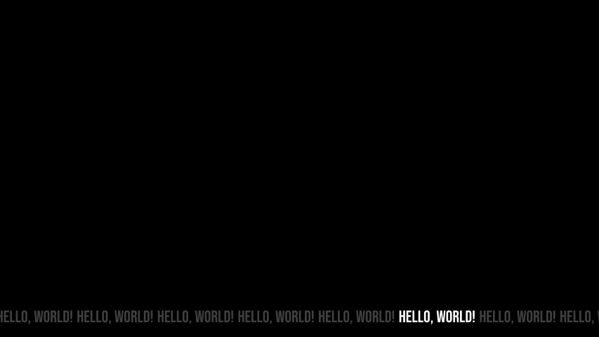

# TIG (Text Image Generator)

DESCRIPTION: TBD.

# Usage (Subject to change)

Requirements:
    - Python 3

1. (optional) create a python environment

    ```sh
    python -m venv .venv
    ```

    and activate it

2. install dependencies

    ```sh
    pip install -r ./requirements.txt
    ```

3. modify constants on the top of the file `line.py` to your liking,

    note: colors should be provided as a full hex colors

4. run script `python ./line.py`

# Footnote

Inspired by stanley parable loading screen

Right now only mode supported is a line of repeated text. More modes and UX without having to modify code directly will be added soon

# Preview of output


