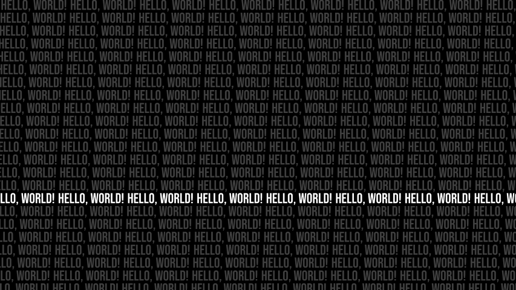

# TIG (Text Image Generator)

> [!WARNING]
> This is a WIP project. Anything can be broken at any time until a stable release!

Inspired by stanley parable loading screen

## Usage (Subject to change)

Requirements:

- Python 3.10+ (tested with 3.13.2)

1. (optional) create a python environment

    ```sh
    python -m venv .venv
    ```

    and activate it

2. install dependencies

    ```sh
    pip install -r ./requirements.txt
    ```

3. run `python ./main.py`

commands are providing help if one of argument `-h, --help, help` is provided or no arguments are provided

## Preview of output

draw line preview


draw fill preview



draw fill with --angle argument preview


